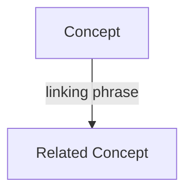
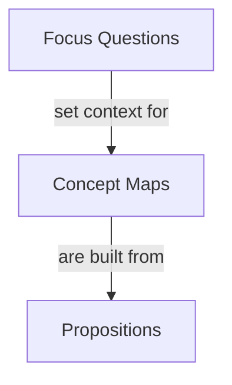
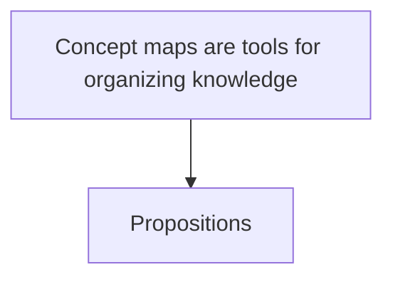

# Novak Concept Maps

Use this skill to create concept maps in the tradition of Joseph D. Novak and Alberto J. Cañas, with Cognitive Task Analysis and assessment uses from Crandall, Klein, Hoffman, Moon, and colleagues. The goal is not a pretty graph. The goal is to represent knowledge as readable propositions so the learner or domain expert can inspect, revise, compare, and test their understanding.

Read `references/research.md` for the source-backed rationale when the user asks for theory, citations, or a careful explanation. Read `references/map-schema.md` when producing file artifacts or using the renderer script.

## Core Commitments

Treat these as the quality bar for every map:

- Start from a focus question. A concept map answers a particular question in a particular context. For non-trivial maps, confirm the focus question before building the map.
- Use concepts as concise labels for perceived regularities in objects, events, or records. Prefer one to three words. Do not put whole sentences in concept boxes.
- Use propositions as the basic unit. Every linked pair should read as: `Concept -> linking phrase -> Concept`. The resulting sentence should make sense on its own.
- Put linking phrases on links, not inside concept boxes. Linking phrases should usually include a verb and should be as brief as the relationship allows.
- Build a hierarchy. Put the most general, inclusive concepts near the top and more specific concepts below. For beginners, prefer one root concept unless the domain clearly needs more.
- Use a parking lot before finalizing. List relevant concepts first, then rank and connect them.
- Add cross-links selectively. Cross-links connect different map regions and often reveal integration or creativity. Do not add every possible relationship.
- Distinguish examples from concepts. Specific examples can clarify a concept, but they are not usually concept nodes.
- Distinguish subject-matter concepts from task framing. The user's motivation, source context, artifact plan, and status notes may be useful, but they usually belong in the title, focus question, side panel, resources, notes, or assessment context rather than in concept boxes.
- Treat maps as revisable. A good map usually needs several passes. Include a short revision checklist.
- Watch for misconceptions. A misconception is often a missing concept, a wrong connection, or a vague linking phrase.
- Preserve the mapmaker's language when eliciting expertise. In CTA work, offer possible linking phrases as alternatives, then let the practitioner choose or correct the wording.
- For assessment, compare proposition structures before judging the visual layout. Differences in concepts, links, hierarchy, cross-links, detail, and perspective-taking are more meaningful than whether two maps look alike.
- Keep the human in the interpretive loop. Codex can organize, merge, compare, and surface patterns, but the learner or domain expert should confirm the frame, labels, and interpretation.

## Workflow

1. Define and, when needed, confirm the focus question.
2. Extract or propose a parking lot of concepts. For normal maps use about 15 to 25 concepts. For quick learning exercises, use 6 to 12.
3. Audit the parking lot for concept eligibility. Split candidates into subject-matter concepts, task/context metadata, and learning or assessment notes.
4. Rank eligible concepts from general to specific.
5. Draft propositions. Each proposition must be readable as a short sentence.
6. Search for 1 to 4 useful cross-links between different regions of the map.
7. For saved artifacts, render the map as standalone HTML first. The HTML view should use separate visual objects for concept boxes and linking phrases, with lines from concept to linking phrase to concept.
8. Also provide a proposition table so the map remains inspectable even if the visual layout needs revision.
9. Add learning exercises when the user's goal is study, retrieval practice, tutoring, or diagnosis.

## Focus Question Checkpoint

Before building a non-trivial concept map, confirm the focus question. The focus question controls which concepts belong in the map, which propositions matter, and what counts as off-topic framing.

If the user gives a clear focus question, restate it briefly and proceed.

If the user gives only a topic, document, broad learning goal, or vague request, propose 2 to 4 focus-question options and ask the user to choose or edit one before creating the full map. Make the options meaningfully different, because each question implies a different concept set and hierarchy.

Good focus-question options usually differ by purpose:

- structure: "How do the main parts of this subject relate?"
- mechanism: "How does this process work?"
- comparison: "How does X differ from Y?"
- diagnosis: "What does this learner understand or misunderstand?"
- action: "What should someone do next, and why?"

Do not spend time creating the full map, hand-placing coordinates, or rendering artifacts until the focus question is confirmed.

Exception: for a tiny inline example, a quick sketch, or an exploratory draft, infer a focus question and label it as assumed. For saved artifacts, assessment maps, maps based on multiple sources, or maps the user wants to inspect visually, stop at the checkpoint first.

## Concept Eligibility

Before adding a node, decide whether it belongs to the subject being mapped or to the surrounding task.

Use a node only when it names something that participates in the domain structure: an object, event, process, state, property, method, tool, role, constraint, or relationship that helps answer the focus question.

Do not use nodes for framing information about the task itself, such as:

- why the user wants the map
- where the information came from
- how the map will be used
- the agent's plan for producing the artifact
- labels that organize the conversation rather than the subject matter
- status judgments about the learner, author, source, or artifact

Keep task framing in the title, focus question, side panel, notes, resources, or assessment context instead.

Before rendering, audit every node:

1. Does this label name something inside the subject matter?
2. Can it form a meaningful proposition with another domain concept?
3. Would the map still answer the focus question if this label moved to metadata?
4. Is this label mainly about the map-making situation rather than the topic?

If a node fails the audit, move it out of the concept map.

## Direction And Arrows

Use arrowheads as reading-direction cues for propositions. They are especially helpful when the relationship is asymmetric:

- sequence or procedure: `zero_grad -> comes before -> backward`
- cause or effect: `Axial Tilt -> causes -> Seasons`
- input, output, or transformation: `Model -> produces -> Prediction`
- prerequisite or dependency: `Meaningful Learning -> requires -> Prior Knowledge`
- part-whole or membership: `Model -> has learnable -> Parameters`
- evidence, implication, or constraint: `Loss -> guides -> Update Direction`

Keep arrows for most learning and assessment maps because they reduce ambiguity for the learner. Do not use arrows as a substitute for a good linking phrase; the proposition still needs to read clearly as `Concept -> linking phrase -> Concept`.

Omit arrows only when the relation is genuinely symmetric or when matching a source map style that intentionally omits direction. If a link can be read both ways without changing meaning, set `arrow: false` in the JSON proposition and make the linking phrase symmetric, for example `is related to` or `is similar to`.

## Choose The Mode

Use `learning mode` when the user wants to study a topic, diagnose their own understanding, or practice retrieval. Include exercises and answer keys.

Use `knowledge elicitation mode` when the user wants to interview an expert, capture tacit knowledge, onboard into a domain, compare team mental models, or build a knowledge model for an organization. Include interview prompts, facilitator guidance, and a refinement plan.

Use `assessment mode` when the user wants to compare a learner map with a reference map, diagnose knowledge gaps, generate pre/post training checks, build Multiple Choice Concept Maps, or create Select-And-Fill-In exercises. Include an orientation prompt, a reference/learner comparison, targeted items, scoring guidance, and reflection prompts.

Use `artifact mode` when the user wants saved files or a side-panel visual. Produce a JSON source model first, then render standalone HTML. Also emit Markdown/Mermaid and CXL as secondary formats.

When the user wants a map that looks close to Novak/Cañas or CmapTools examples, do not rely on automatic layout alone. Use explicit `x`/`y` positions for concepts and `phrase_x`/`phrase_y` positions for linking phrases. Keep `rank` as the semantic hierarchy: lower ranks belong higher in the map even when hand-tuned positions are used.

## Output Format

For ordinary chat answers, use this structure. This is a lightweight fallback, not the preferred visual artifact:

````markdown
## Focus Question
[question]

## Concept Map


## Propositions
| ID | Proposition | Type |
|---|---|---|
| P1 | Concept linking phrase Related Concept | hierarchy |

## Learning Checks
...

## Revision Checks
...
````

Use `flowchart TB` only for quick inline display. Markdown renderers often cannot display Novak-style maps close to CmapTools because the linking phrase is not a separate movable object. For serious map viewing, generate the standalone HTML artifact.

Good:



Weak:



The weak version hides a sentence inside the concept box and omits the linking phrase.

## Learning Exercises

When the user asks for learning help, include at least two of these. Keep answer keys in a collapsible section unless the user wants no answers.

### Fill The Linking Phrase

Hide the linking phrase and ask the learner to supply it.

```text
Concept Maps -> ________ -> Propositions
```

Good distractors are close but meaningfully different. Avoid arbitrary grammar games.

### Choose The Concept

Hide one concept from a proposition.

```text
Meaningful Learning -> requires integration with -> ________
A. prior knowledge
B. short-term memory
C. diagram styling
```

### Choose The Link

Give two concepts and ask which linking phrase makes the best proposition.

```text
Focus Question -> ? -> Concept Map
A. decorates
B. sets context for
C. is an example of
```

### Misconception Repair

Present a faulty proposition and ask what is wrong.

```text
Faulty: Concept Maps -> are the same as -> Mind Maps
Repair: Concept Maps -> differ from -> Mind Maps
Reason: concept maps require explicit linking phrases that form propositions.
```

### Map Reconstruction

Give a parking lot and a focus question, then ask the learner to rebuild a small map before showing the answer.

### Multiple Choice Concept Map

Use MCCM when the learner should reason inside the context of a map instead of answering a detached quiz item. Hide one element in a proposition, branch, or local map region. The hidden element can be a concept, linking phrase, whole proposition, or map level.

```text
In the map region below, which linking phrase best completes the proposition?
Focus Question -> ________ -> Concept Map
A. decorates
B. sets context for
C. duplicates
```

Use close distractors drawn from likely novice or intermediate misunderstandings. Before the item, orient the learner to the task because MCCM formats can confuse adults who are used to normal multiple choice questions.

### Select And Fill In

Use SAFI when the learner should both choose from supplied elements and construct missing language. This is useful for adult learners because it lowers the blank-page burden without reducing the task to recognition.

```text
Choose two concepts from the list and write the linking phrase that makes the strongest proposition.
Concepts: prior knowledge, meaningful learning, diagram styling, rote memorization
Answer: Meaningful Learning -> requires connection with -> Prior Knowledge
```

## Knowledge Elicitation Mode

Use this mode for Cognitive Task Analysis, domain onboarding, expert interviews, and team knowledge capture.

Start with a bounded domain and a focus question. For a first session, it can help to begin with either a big-picture map or a small familiar subdomain so the practitioner gets comfortable with concept mapping.

When facilitating:

- Ask the practitioner for 5 to 10 broad, important concepts first.
- Put those concepts in a parking lot before linking everything.
- Avoid letting the map dive into details too early; arrange general concepts near the top first.
- Offer candidate linking phrases only as tentative alternatives, for example: `leads to?`, `requires?`, `is a precondition for?`, `is evidence for?`
- Keep the practitioner's preferred terms unless they obscure the proposition.
- If the practitioner gets stuck, move to another part of the map. The explanation that follows often reveals the missing proposition.
- Watch for concepts with too many direct children. More than four or five linked concepts beneath one concept often means an intermediate concept is missing.
- Prefer one occurrence of a concept label in a map. Repeated concepts usually signal that the map can be rearranged.
- Split large maps into submaps when the map becomes too large for a screen or mixes granularities.

For team mapping:

- Keep groups small when possible. Five or fewer is a useful working size.
- Consider having individuals make maps first, then compare propositions.
- Look for shared propositions, unique propositions, and conflicting linking phrases.
- Build a consensus map from the best propositions, not by averaging vague wording.

For knowledge models:

- Link multiple maps with a map-of-maps.
- Attach resources to concepts when they make the knowledge more concrete: examples, cases, images, operating procedures, manuals, forms, videos, or live data links.
- Treat resources as part of the map's usefulness, not as decoration.

## Assessment Mode

Use this mode when the user wants concept maps to help a learner, team, or expert compare knowledge states. The assessment should be based on propositions, not graphic resemblance.

Start by orienting the learner:

```text
You will answer inside a concept map. Read each concept-link-concept line as a short sentence. The question may ask for a missing concept, a missing linking phrase, or the best proposition in a small map region.
```

Then follow this workflow:

1. Define the learning or performance objective and focus question.
2. Elicit or draft a reference map. This may be an expert map, instructor map, source-grounded map, or consensus map.
3. Elicit or draft the learner map. If the learner has no map, use a small partial map, parking lot, MCCM, or SAFI task.
4. Compare maps propositionally:
   - shared propositions
   - missing concepts
   - extra or off-focus concepts
   - weak, vague, or incorrect linking phrases
   - missing cross-links
   - hierarchy differences
   - differences in detail, nuance, and perspective-taking
5. Turn differences into assessment areas. Avoid testing only simple propositions that novices already know.
6. Generate targeted tasks: MCCM, SAFI, fill-link, choose-concept, choose-link, misconception repair, or map reconstruction.
7. Score with an explicit local rubric. Label the rubric as derived unless the user provides an official scoring scheme.
8. End with reflection: ask what the learner included, omitted, overstated, understated, or connected differently.

When building assessment items from an expert map:

- Remove extraneous content that is not needed for the focus question.
- Merge synonyms after confirming they really mean the same thing in the domain.
- Add superordinate concepts when they help organize scattered details.
- Preserve useful expert nuance instead of flattening it into beginner wording.
- Keep source or audit-trail notes when propositions came from interviews, documents, or prior maps.

For pre/post assessment:

- Keep the focus question stable across versions.
- Compare proposition counts only as a rough signal. More propositions do not automatically mean better understanding.
- Look for new valid propositions, repaired misconceptions, improved linking phrases, better hierarchy, and more useful cross-links.
- Surface changes as learning evidence and invite the learner to explain the most important changes.

For large maps:

- Use a proposition list, theme filters, submaps, and map-of-maps before asking the user to interpret the whole structure.
- Ask the human for an interpretive frame or tentative hypothesis. Tools can expose patterns, but they cannot decide which themes matter.
- Preserve auditability from source statement to proposition to theme to conclusion.

## Artifact Workflow

For reusable outputs, create a JSON map using the schema in `references/map-schema.md`, then run:

```bash
python scripts/cmap_artifact.py examples/meaningful-learning.json --out-dir /path/to/output
```

The script writes:

- `*.html` with a CmapTools-like canvas: concept boxes, linking phrase boxes, two-segment proposition lines, side panels for propositions and exercises, and zoom controls.
- `*.md` with a Mermaid concept map, propositions, and learning checks.
- `*.mmd` with only the Mermaid source.
- `*.cxl` with a minimal CmapTools-compatible XML representation.

Prefer the HTML output when the user wants to see the map in Codex. Use Mermaid only as a quick fallback. The proposition table is the source of truth; every diagram is a view.

The HTML renderer supports:

- `theme: "cmap-yellow"` for the yellow CmapTools-like style used in the Birds and Seasons examples.
- `theme: "cmap-blue"` for the blue-outline style used in the large "Concept Maps" example.
- `?details=hidden` on the HTML URL to hide the proposition side panel and give the canvas more room.
- explicit concept coordinates (`x`, `y`, optional `w`, `h`) and explicit linking phrase coordinates (`phrase_x`, `phrase_y`) for faithful replicas.
- assessment exercise metadata such as `type`, `rationale`, and `rubric` in the learning-check side panel.

## Quality Checks

Before returning the map, check:

- Does the map answer the focus question?
- Can every edge be read as a proposition?
- Are linking phrases concise and verb-bearing where appropriate?
- Are concept labels short, not sentences?
- Are all concept boxes subject-matter concepts rather than task framing, source context, artifact plans, or status notes?
- Is each important concept present only once unless there is a clear reason?
- Do arrows clarify proposition reading direction? Are any undirected links genuinely symmetric?
- Is there a general-to-specific hierarchy?
- Are cross-links useful rather than decorative?
- Is the map's granularity consistent with the focus question?
- Should an overlarge branch become a submap?
- Are misconceptions or weak propositions called out?
- Can the learner use the exercises without seeing the answer immediately?
- For CTA work, does the map preserve the domain practitioner's wording where possible?
- For assessment, are items generated from meaningful expert-learner differences rather than random facts?
- Is the learner oriented before MCCM or SAFI tasks?
- Is the scoring rubric explicit about what counts as correct, partial, or incorrect?
- Is any source-to-proposition audit trail preserved when the map came from interviews or documents?

## Sources

The source notes are in `references/research.md`. The key primary sources are Novak and Cañas, "The Theory Underlying Concept Maps and How to Construct and Use Them"; IHMC Cmap documentation on concept maps, propositions, and CXL; Novak and Gowin, `Learning How to Learn`; Novak, `Learning, Creating, and Using Knowledge`; Crandall, Klein, and Hoffman, `Working Minds`; and Moon et al. on concept-map-based assessment for adult learners and large-scale analysis maps.
