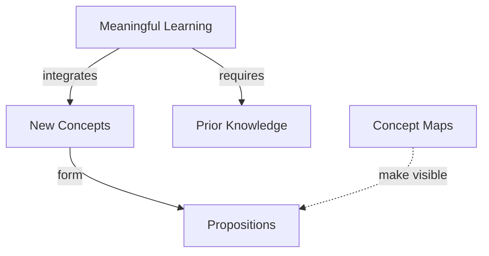

# Meaningful Learning Assessment

## Focus Question
How does meaningful learning happen?

## Concept Map

## Propositions
| ID | Proposition | Type |
|---|---|---|
| P1 | Meaningful Learning requires Prior Knowledge | hierarchy |
| P2 | Meaningful Learning integrates New Concepts | hierarchy |
| P3 | New Concepts form Propositions | hierarchy |
| P4 | Concept Maps make visible Propositions | cross-link |

## Assessment Context

- Objective: Diagnose whether the learner treats meaningful learning as integration with prior knowledge rather than as diagram styling.
- Orientation: Read each concept-link-concept line as a sentence. Some questions ask for a missing concept or linking phrase inside the map.
- Reference map: expert meaningful-learning map
- Learner map: learner draft map

### Comparison Summary

- Reference map treats prior knowledge as required for meaningful learning.
- Common weak learner map treats concept maps mainly as attractive diagrams.
- Assessment should target the relation among prior knowledge, new concepts, and propositions.

## Parking Lot

- Meaningful Learning
- Prior Knowledge
- New Concepts
- Propositions
- Concept Maps
- Rote Memorization

## Learning Checks

1. **mccm:** Which linking phrase best completes this proposition: Meaningful Learning -> ________ -> Prior Knowledge?
   - requires
   - decorates
   - is unrelated to
2. **safi:** Choose two concepts from the parking lot and write a linking phrase that explains why concept maps help diagnose understanding.

Answer Key

1. requires
   - Rationale: The item tests whether the learner sees prior knowledge as a condition for meaningful learning.
   - Rubric: Correct: selects a necessity relation. Partial: explains prior knowledge matters but chooses a vague link. Incorrect: treats prior knowledge as irrelevant.
2. Concept Maps -> make visible -> Propositions
   - Rationale: A strong answer names the proposition structure, not just the visual look of the map.
   - Rubric: Correct: links concept maps to propositions or relationships. Partial: links concept maps to concepts only. Incorrect: focuses only on neatness, memory, or decoration.

## Revision Checks

- Does every proposition answer the focus question or support an answer?
- Are the linking phrases brief and specific?
- Are concept labels short rather than sentence-like?
- Are cross-links useful rather than decorative?
