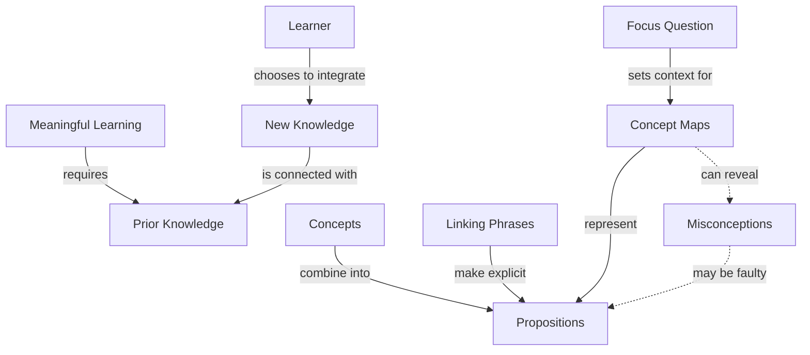

# Meaningful Learning

## Focus Question
How does meaningful learning happen in Novak's concept mapping theory?

## Concept Map

## Propositions
| ID | Proposition | Type | Sources |
|---|---|---|---|
| P1 | Meaningful Learning requires Prior Knowledge | hierarchy | novak-2002 |
| P2 | Learner chooses to integrate New Knowledge | hierarchy | novak-2002 |
| P3 | New Knowledge is connected with Prior Knowledge | hierarchy | novak-2002 |
| P4 | Concepts combine into Propositions | hierarchy | novak-canas-2008 |
| P5 | Linking Phrases make explicit Propositions | hierarchy | novak-canas-2008 |
| P6 | Concept Maps represent Propositions | hierarchy | novak-canas-2008 |
| P7 | Focus Question sets context for Concept Maps | hierarchy | novak-canas-2008 |
| P8 | Concept Maps can reveal Misconceptions | cross-link | novak-2002, novak-canas-2008 |
| P9 | Misconceptions may be faulty Propositions | cross-link | novak-2002 |

## Sources

| ID | Source |
|---|---|
| novak-2002 | [Novak, J. D. (2002). Meaningful Learning: The Essential Factor for Conceptual Change.](https://doi.org/10.1002/sce.10032) |
| novak-canas-2008 | [Novak, J. D., and Cañas, A. J. (2008). The Theory Underlying Concept Maps.](https://cmap.ihmc.us/docs/theory-of-concept-maps) |

## Parking Lot

- Meaningful Learning
- Learner
- Prior Knowledge
- New Knowledge
- Concepts
- Propositions
- Linking Phrases
- Concept Maps
- Focus Question
- Misconceptions

## Learning Checks

1. **fill link:** Concept Maps -> ________ -> Propositions
2. **choose link:** Focus Question -> ? -> Concept Maps
   - decorates
   - sets context for
   - is an example of
3. **repair misconception:** Faulty: Concepts -> are the same as -> Propositions. What repair would make this Novak-style?

Answer Key

1. represent
2. sets context for
3. Concepts -> combine into -> Propositions

## Revision Checks

- Does every proposition answer the focus question or support an answer?
- Are the linking phrases brief and specific?
- Are concept labels short rather than sentence-like?
- Are cross-links useful rather than decorative?
