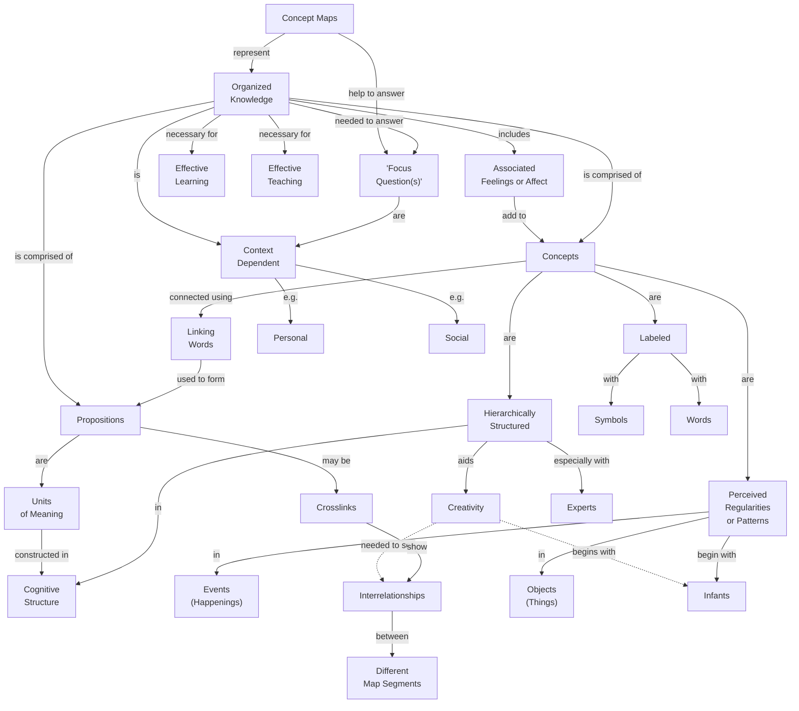

# Concept Maps

## Focus Question
What are the key features of concept maps?

## Concept Map

## Propositions
| ID | Proposition | Type |
|---|---|---|
| P1 | Concept Maps represent Organized
Knowledge | hierarchy |
| P2 | Concept Maps help to answer "Focus
Question(s)" | hierarchy |
| P3 | Organized
Knowledge needed to answer "Focus
Question(s)" | hierarchy |
| P4 | Organized
Knowledge includes Associated
Feelings or Affect | hierarchy |
| P5 | Associated
Feelings or Affect add to Concepts | hierarchy |
| P6 | Organized
Knowledge is comprised of Concepts | hierarchy |
| P7 | Organized
Knowledge is comprised of Propositions | hierarchy |
| P8 | Concepts connected using Linking
Words | hierarchy |
| P9 | Linking
Words used to form Propositions | hierarchy |
| P10 | Concepts are Perceived
Regularities
or Patterns | hierarchy |
| P11 | Concepts are Labeled | hierarchy |
| P12 | Concepts are Hierarchically
Structured | hierarchy |
| P13 | Propositions are Units
of Meaning | hierarchy |
| P14 | Propositions may be Crosslinks | hierarchy |
| P15 | Organized
Knowledge is Context
Dependent | hierarchy |
| P16 | "Focus
Question(s)" are Context
Dependent | hierarchy |
| P17 | Organized
Knowledge necessary for Effective
Teaching | hierarchy |
| P18 | Organized
Knowledge necessary for Effective
Learning | hierarchy |
| P19 | Context
Dependent e.g. Personal | hierarchy |
| P20 | Context
Dependent e.g. Social | hierarchy |
| P21 | Perceived
Regularities
or Patterns in Events
(Happenings) | hierarchy |
| P22 | Perceived
Regularities
or Patterns in Objects
(Things) | hierarchy |
| P23 | Labeled with Symbols | hierarchy |
| P24 | Labeled with Words | hierarchy |
| P25 | Units
of Meaning constructed in Cognitive
Structure | hierarchy |
| P26 | Hierarchically
Structured aids Creativity | hierarchy |
| P27 | Hierarchically
Structured especially with Experts | hierarchy |
| P28 | Hierarchically
Structured in Cognitive
Structure | hierarchy |
| P29 | Creativity begins with Infants | cross-link |
| P30 | Perceived
Regularities
or Patterns begin with Infants | hierarchy |
| P31 | Creativity needed to see Interrelationships | cross-link |
| P32 | Crosslinks show Interrelationships | hierarchy |
| P33 | Interrelationships between Different
Map Segments | hierarchy |

## Parking Lot

- Concept Maps
- Organized Knowledge
- Focus Questions
- Concepts
- Linking Words
- Propositions
- Crosslinks
- Interrelationships
- Creativity

## Learning Checks

1. Concept Maps -> ________ -> Organized Knowledge
2. Faulty: Concept Maps -> are decorative diagrams for -> Organized Knowledge

Answer Key

1. represent
2. Concept Maps -> represent -> Organized Knowledge

## Revision Checks

- Does every proposition answer the focus question or support an answer?
- Are the linking phrases brief and specific?
- Are concept labels short rather than sentence-like?
- Are cross-links useful rather than decorative?
