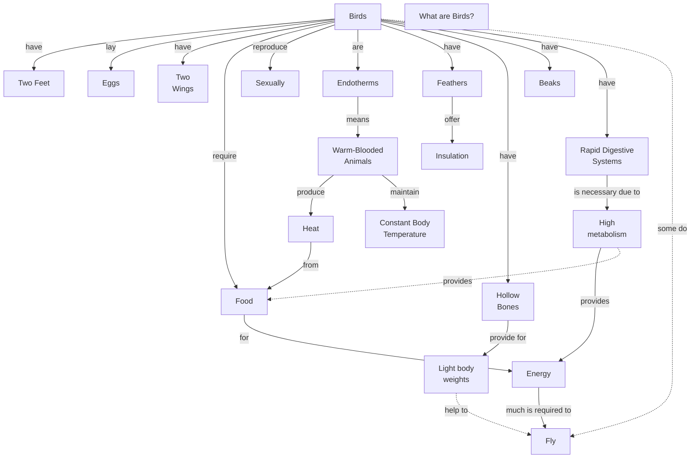

# What Are Birds

## Focus Question
What are birds?

## Concept Map

## Propositions
| ID | Proposition | Type |
|---|---|---|
| P1 | Birds have Two Feet | hierarchy |
| P2 | Birds lay Eggs | hierarchy |
| P3 | Birds have Two
Wings | hierarchy |
| P4 | Birds require Food | hierarchy |
| P5 | Birds reproduce Sexually | hierarchy |
| P6 | Birds are Endotherms | hierarchy |
| P7 | Birds have Feathers | hierarchy |
| P8 | Birds have Hollow
Bones | hierarchy |
| P9 | Birds have Beaks | hierarchy |
| P10 | Birds have Rapid Digestive
Systems | hierarchy |
| P11 | Feathers offer Insulation | hierarchy |
| P12 | Hollow
Bones provide for Light body
weights | hierarchy |
| P13 | Rapid Digestive
Systems is necessary due to High
metabolism | hierarchy |
| P14 | High
metabolism provides Energy | hierarchy |
| P15 | Food for Energy | hierarchy |
| P16 | Heat from Food | hierarchy |
| P17 | Warm-Blooded
Animals produce Heat | hierarchy |
| P18 | Endotherms means Warm-Blooded
Animals | hierarchy |
| P19 | Warm-Blooded
Animals maintain Constant Body
Temperature | hierarchy |
| P20 | Energy much is required to Fly | hierarchy |
| P21 | Light body
weights help to Fly | cross-link |
| P22 | Birds some do Fly | cross-link |
| P23 | High
metabolism provides Food | cross-link |

## Parking Lot

- Birds
- Two Feet
- Eggs
- Two Wings
- Food
- Endotherms
- Feathers
- Hollow Bones
- Rapid Digestive Systems
- High Metabolism
- Energy
- Fly

## Learning Checks

1. Birds -> ________ -> Eggs
2. Warm-Blooded Animals -> maintain -> ________
   - Constant Body Temperature
   - Two Wings
   - Insulation

Answer Key

1. lay
2. Constant Body Temperature

## Revision Checks

- Does every proposition answer the focus question or support an answer?
- Are the linking phrases brief and specific?
- Are concept labels short rather than sentence-like?
- Are cross-links useful rather than decorative?
