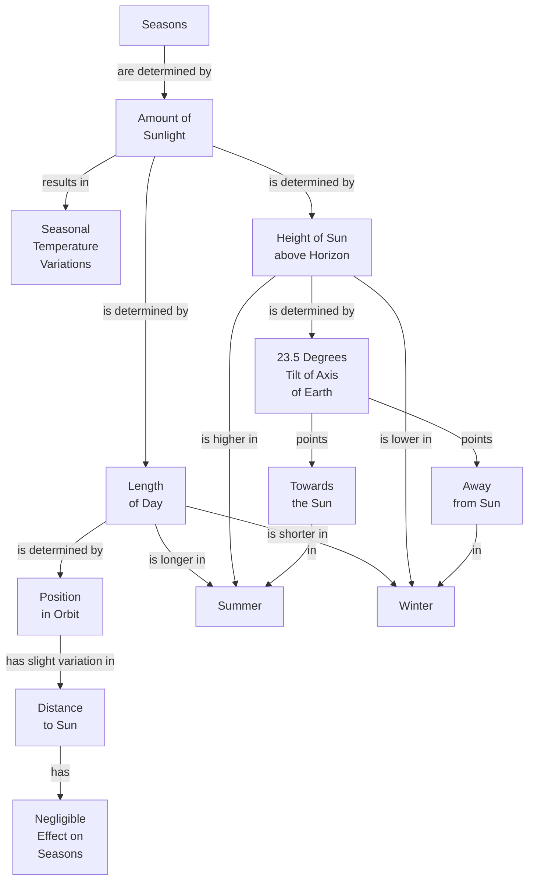

# What Causes Seasons

## Focus Question
What causes seasons?

## Concept Map

## Propositions
| ID | Proposition | Type |
|---|---|---|
| P1 | Seasons are determined by Amount of
Sunlight | hierarchy |
| P2 | Amount of
Sunlight results in Seasonal
Temperature
Variations | hierarchy |
| P3 | Amount of
Sunlight is determined by Length
of Day | hierarchy |
| P4 | Amount of
Sunlight is determined by Height of Sun
above Horizon | hierarchy |
| P5 | Length
of Day is longer in Summer | hierarchy |
| P6 | Length
of Day is shorter in Winter | hierarchy |
| P7 | Height of Sun
above Horizon is higher in Summer | hierarchy |
| P8 | Height of Sun
above Horizon is lower in Winter | hierarchy |
| P9 | Height of Sun
above Horizon is determined by 23.5 Degrees
Tilt of Axis
of Earth | hierarchy |
| P10 | Length
of Day is determined by Position
in Orbit | hierarchy |
| P11 | 23.5 Degrees
Tilt of Axis
of Earth points Towards
the Sun | hierarchy |
| P12 | 23.5 Degrees
Tilt of Axis
of Earth points Away
from Sun | hierarchy |
| P13 | Towards
the Sun in Summer | hierarchy |
| P14 | Away
from Sun in Winter | hierarchy |
| P15 | Position
in Orbit has slight variation in Distance
to Sun | hierarchy |
| P16 | Distance
to Sun has Negligible
Effect on
Seasons | hierarchy |

## Parking Lot

- Seasons
- Amount of Sunlight
- Seasonal Temperature Variations
- Length of Day
- Height of Sun above Horizon
- Summer
- Winter
- 23.5 Degrees Tilt of Axis of Earth
- Position in Orbit
- Distance to Sun

## Learning Checks

1. Seasons -> ________ -> Amount of Sunlight
2. Height of Sun above Horizon -> ? -> Winter
   - is lower in
   - is longer in
   - has slight variation in

Answer Key

1. are determined by
2. is lower in

## Revision Checks

- Does every proposition answer the focus question or support an answer?
- Are the linking phrases brief and specific?
- Are concept labels short rather than sentence-like?
- Are cross-links useful rather than decorative?
